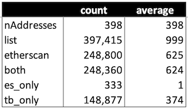

# TrueBlocks Comparison with EtherScan

A repository used to compare EtherScan against TrueBlocks.

- [TrueBlocks Comparison with EtherScan](#trueblocks-comparison-with-etherscan)
  - [Folder Structure](#folder-structure)
  - [Code Structure](#code-structure)
  - [The Addresses.txt File](#the-addressestxt-file)
  - [The Code](#the-code)
    - [Downloading the data](#downloading-the-data)
    - [Comparing the data](#comparing-the-data)
  - [The Results](#the-results)

## Folder Structure

```[shell]
.                  # The root of the repo. Where the code is stored.
├── bin            # The location of the built file.
└── store          # The location of all the data.
    ├── etherscan  # A folder containing all data downloaded from EtherScan.
    ├── list       # A folder containing all the data produced by chifra list.
    ├── both       # A folder containing appearances found in both data sources.
    ├── es_only    # A folder containing appearances found only in EtherScan.
    └── tb_only    # A folder containing appearances found only in TrueBlocks.
```

## Code Structure

The code is written in GoLang and is located in the root of the repo. It is split into 3 files:

```[shell]
├── main.go        # The main file. It is used to run the code
├── compare.go     # The file containing the code to compare the data
└── download.go    # The file containing the code to download the data
```

## The Addresses.txt File

Also at the root of the repo is a file called `addresses.txt.`. This is the list of addresses we compared. It is used to download the data from EtherScan and `chifra`. Feel free to replace this file with your own list of addresses.

## The Code

The code to run the comparison is located in `main.go`. Read this very simple file. It calls into two processes located in `download.go` (optional) and `compare.go.`

### Downloading the data

The `download.go` file contains the code used to download the data from each source. It reads the `addresses.txt` file and processes each line using `chifra` and `os.System`. The code first creates a list of all appearances using `chifra list`. It stores this list into the `store/list` folder. The data has the form:

```[shell]
blockNumber,transactionIndex
```

Next, we count how many records are found by `chifra list.` If there's not too many (EtherScan doesn't download more than 10,000 records, so we ignore addresses with more than 10,000 records), we procede to download from EtherScan. It stores the EtherScan data into the `store/etherscan` folder.

The command it uses for `chifra list` is:

```[shell]
chifra list --no_header --last_block 18517000 --fmt csv <address> | cut -d, -f 1,2 >store/list/<address>.csv
```

If there's less than 10,000 records, it downloads from EtherScan using the command:

```[shell]
chifra slurp --types all 0-18517000 --fmt csv <address> | cut -d, -f 1,2 >store/etherscan/<address>.csv
```

Note that the `chifra slurp` command has a `--types` option which takes a value of `all`. This means it hits all eight of EtherScan's API's data types: `ext | int | token | nfts | 1155 | miner | uncles | withdrawals`. This is the only way to get all the data from EtherScan. This, when combined with EtherScan's rate limiting, means that this process takes a long time to run. `chifra list` is WAY faster.

At the end of this process, we have one file in each of the two folders (`store/list` and `store/etherscan`) for each address in the `addresses.txt` file with less than 10,000 appearances. The with the name of the file is `<address>.csv`. This allows us to compare the results easily.

The process will only run the `download` process if you provide the `--download` flag. Otherwise, it only compares existing data.

Note that in both cases, we use the `cut` command to extract the first two columns of the data. This is the `blockNumber` and `transactionIndex`. Also, notice that we stop the search at block `18517000` in both cases to ensure a fair comparison.

### Comparing the data

To compare the files, we read in the files from both folders (`./etherscan` and `./list`) for each address. As we read the files, we enter each appearance into a map mapping the appearance to a `Diff` structure which simply a pair of two `booleans`. Like this:

```[go]
type Diff struct {
    app        Appearance
    etherscan  bool
    trueblocks bool
}

type DiffMap map[Appearance]Diff
```

An `Appearance` is simply a pair of `blockNumber` and `transactionIndex`:

```[go]
type Appearance struct {
    blockNumber      uint64
    transactionIndex uint64
}
```

If an appearance is found in the `etherscan` file, we light up the `etherscan` boolean. If it's found in the `list` file, we light up the `trueblocks` boolean. At the end of the process, we have a map containing all the appearances in both files.

There are three cases:

1. Both booleans are lit -- we write these records to the `both` folder in a file called `<address>.csv`.
2. Only the `etherscan` boolean is lit -- we write these records to the `es_only` folder.
3. Only the `trueblocks` boolean is lit -- we write these records to the `tb_only` folder.

And we're done.

## The Results

In all cases, TrueBlocks finds more appearances than Etherscan with the single exception that Etherscan has a bug when reporting uncles prior to block 100,000. If we correct for this bug (see below), TrueBlocks finds more appearances in every cases.

Here's some numbers:


