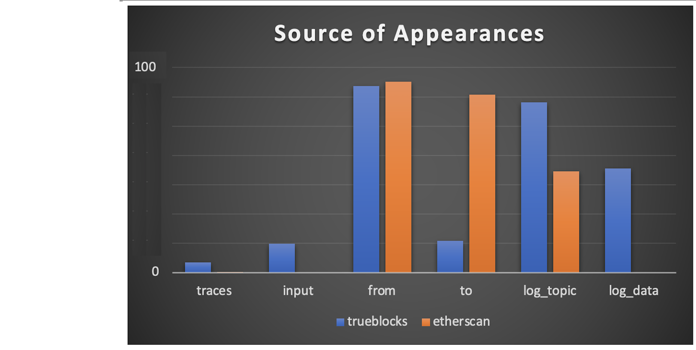

# TrueBlocks Comparison with EtherScan

A repository used to compare EtherScan against TrueBlocks.

- [TrueBlocks Comparison with EtherScan](#trueblocks-comparison-with-etherscan)
  - [Folder Structure](#folder-structure)
  - [Code Structure](#code-structure)
  - [The Addresses.txt File](#the-addressestxt-file)
  - [The Code](#the-code)
    - [Downloading the data](#downloading-the-data)
    - [Comparing the data](#comparing-the-data)
  - [The Results](#the-results)
    - [Bug in EtherScan related to Uncles](#bug-in-etherscan-related-to-uncles)
    - [Why does TrueBlocks find more appearances?](#why-does-trueblocks-find-more-appearances)
  - [Why Does It Matter?](#why-does-it-matter)

## Folder Structure

```[shell]
.                  # The root of the repo. Where the code is stored.
├── bin            # The location of the built file.
└── store          # The location of all the data.
    ├── etherscan  # A folder containing all data downloaded from EtherScan.
    ├── list       # A folder containing all the data produced by chifra list.
    ├── both       # A folder containing appearances found in both data sources.
    ├── es_only    # A folder containing appearances found only in EtherScan.
    └── tb_only    # A folder containing appearances found only in TrueBlocks.
```

## Code Structure

The code is written in GoLang and is located in the root of the repo. It is split into 3 files:

```[shell]
├── main.go        # The main file. It is used to run the code
├── compare.go     # The file containing the code to compare the data
└── download.go    # The file containing the code to download the data
```

## The Addresses.txt File

Also at the root of the repo is a file called `addresses.txt.`. This is the list of addresses we compared. It is used to download the data from EtherScan and `chifra`. Feel free to replace this file with your own list of addresses.

## The Code

The code to run the comparison is located in `main.go`. Read this very simple file. It calls into two processes located in `download.go` (optional) and `compare.go.`

### Downloading the data

The `download.go` file contains the code used to download the data from each source. It reads the `addresses.txt` file and processes each line using `chifra` and `os.System`. The code first creates a list of all appearances using `chifra list`. It stores this list into the `store/list` folder. The data has the form:

```[shell]
blockNumber,transactionIndex
```

Next, we count how many records are found by `chifra list.` If there's not too many (EtherScan doesn't download more than 10,000 records, so we ignore addresses with more than 10,000 records), we procede to download from EtherScan. It stores the EtherScan data into the `store/etherscan` folder.

The command it uses for `chifra list` is:

```[shell]
chifra list --no_header --last_block 18517000 --fmt csv <address> | cut -d, -f 1,2 >store/list/<address>.csv
```

If there's less than 10,000 records, it downloads from EtherScan using the command:

```[shell]
chifra slurp --types all 0-18517000 --fmt csv <address> | cut -d, -f 1,2 >store/etherscan/<address>.csv
```

Note that the `chifra slurp` command has a `--types` option which takes a value of `all`. This means it hits all eight of EtherScan's API's data types: `ext | int | token | nfts | 1155 | miner | uncles | withdrawals`. This is the only way to get all the data from EtherScan. This, when combined with EtherScan's rate limiting, means that this process takes a long time to run. `chifra list` is WAY faster.

At the end of this process, we have one file in each of the two folders (`store/list` and `store/etherscan`) for each address in the `addresses.txt` file with less than 10,000 appearances. The with the name of the file is `<address>.csv`. This allows us to compare the results easily.

The process will only run the `download` process if you provide the `--download` flag. Otherwise, it only compares existing data.

Note that in both cases, we use the `cut` command to extract the first two columns of the data. This is the `blockNumber` and `transactionIndex`. Also, notice that we stop the search at block `18517000` in both cases to ensure a fair comparison.

### Comparing the data

To compare the files, we read in the files from both folders (`./etherscan` and `./list`) for each address. As we read the files, we enter each appearance into a map mapping the appearance to a `Diff` structure which simply a pair of two `booleans`. Like this:

```[go]
type Diff struct {
    app        Appearance
    etherscan  bool
    trueblocks bool
}

type DiffMap map[Appearance]Diff
```

An `Appearance` is simply a pair of `blockNumber` and `transactionIndex`:

```[go]
type Appearance struct {
    blockNumber      uint64
    transactionIndex uint64
}
```

If an appearance is found in the `etherscan` file, we light up the `etherscan` boolean. If it's found in the `list` file, we light up the `trueblocks` boolean. At the end of the process, we have a map containing all the appearances in both files.

There are three cases:

1. Both booleans are lit -- we write these records to the `both` folder in a file called `<address>.csv`.
2. Only the `etherscan` boolean is lit -- we write these records to the `es_only` folder.
3. Only the `trueblocks` boolean is lit -- we write these records to the `tb_only` folder.

And we're done.

## The Results

Here's the baseline numbers:


We checked 547 randomly selected addresses. Of those, 98 had more than 10,000 appearances and were ignored. We ignored these becuse Etherscan does not return more than 10,000 records for any given address.

Strike one.

Of the remaining 449 addresses, 435 contained records that were found by both EtherScan and TrueBlocks. This is to be expected. We would hope that in most cases, both systems would return similar lists of appearances (as we'll see this is not the case).

For five address, Etherscan seemingly found more addresses than TrueBlocks. 333 records of this type were found, but this is not the whole story. See the note below on uncles. Etherscan has a bug related to uncles that causes it to return the incorrect block for when the uncle reward was credited. TrueBlocks gets it right.

Strike two.

For 376 of the 449 addresses we checked (that's 83%) TrueBlocks found (sometimes significantly more) appearances.

Strike three.

### Bug in EtherScan related to Uncles

In the 449 addresses we searched, we found six where EtherScan found more appearances than TrueBlocks. In all six cases, the difference was due to a bug in EtherScan related to uncles. The bug is that EtherScan returns the block number when the uncle was found. TrueBlocks returns the block number in which the uncle reward was credited to the miner's account. We know this because we ran the following analysis on all 333 occurrences of this issue.

First, we extracted just the block number from the `etherscan` files. We then calculated 1 block prior to that block number (P) and seven blocks after that block number (A). We then ran:

```[shell]
chifra state --parts balance P-A <address> --changes
```

For example, for address `0x3f98e477a361f777da14611a7e419a75fd238b6b`, Etherscan reports the following appearances:

```[shell]
485,uncle
940,uncle
1114,uncle
...
```

Running:

```[shell]
chifra state --parts balance 484-492 0x48040276e9c17ddbe5c8d2976245dcd0235efa43
```

results in:

```[shell]
blockNumber,address,balance
484,0x48040276e9c17ddbe5c8d2976245dcd0235efa43,0
485,0x48040276e9c17ddbe5c8d2976245dcd0235efa43,0
486,0x48040276e9c17ddbe5c8d2976245dcd0235efa43,0
487,0x48040276e9c17ddbe5c8d2976245dcd0235efa43,3750000000000000000
488,0x48040276e9c17ddbe5c8d2976245dcd0235efa43,3750000000000000000
489,0x48040276e9c17ddbe5c8d2976245dcd0235efa43,3750000000000000000
490,0x48040276e9c17ddbe5c8d2976245dcd0235efa43,3750000000000000000
491,0x48040276e9c17ddbe5c8d2976245dcd0235efa43,3750000000000000000
```

In other words, EtherScan reports the uncle block at block 485. However, the uncle reward was not credited to the miner's account until block 487. TrueBlocks reports the uncle at block 487.

The results of this run are in the data folder in the file called `es_only.txt`.

In all 333 cases, the block EtherScan reports as the uncle block is technically correct. That block is where the uncle was found. However, the uncle reward was not credited to the miner's account until a few blocks later. In every case, that block was the block that TrueBlocks reported. EtherScan got it wrong. Unless you want to lean on a technicality. I would argue that a change in balance of an account is the correct place to note in an address's history. I'll leave it up to EtherScan to decide if they want to fix this bug.

Total number of place where EtherScan legitmately found more appearances than TrueBlocks: 0.

### Why does TrueBlocks find more appearances?

Next we wanted to understand where exactly TrueBlocks is finding more appearances than EtherScan. Luckily we have a very handy tool to do this and all the information we need in the already existing data.

Each file in `store/tb_only` contains the appearances that TrueBlocks found that EtherScan did not. We can use the `chifra transactions --uniq` command to see why those appearances were found by TrueBlocks but not EtherScan.

We're now studying this row in the results:



We looked at each of the 376 files which contained nearly 150,000 more appearancs than EtherScan. We found that in huge percentage of the cases, the difference was due to the fact that TrueBlocks finds appearances in three places:

- in the transaction's input data
- in the topics of the transaction's logs
- in the data field of the transaction's logs

This is totally to be expected as this is exactly where TrueBlocks' Unchained Index looks where other systems do not. In fact, we would expect TrueBlocks to find more appearances than any other system that does not look in these places.

We basically used this greatly simplified alogrithm to find the differences:

```[go]
for each address where TrueBlocks found more appearances
   for each appearance
      list all addresses that also appeared in that transaction (i.e., neighbors)
      check to see why the address in question appeared in that transaction
summarize the results
```

Here's the summary:


As you can see. We find things in places others don't look.

## Why Does It Matter?

Blockchains are perfect, 18-decimal place accurate accounting systems. Every 12 seconds, they come to balance on many hundreds of millions of accounts. That's true on-chain.

It's imporant because we think it should be not only true, but expected, off-chain as well. We think that if you're going to build a system that claims to be a blockchain explorer, you should be able to account for every wei of every account. That's what TrueBlocks does. That's what TrueBlocks is.
