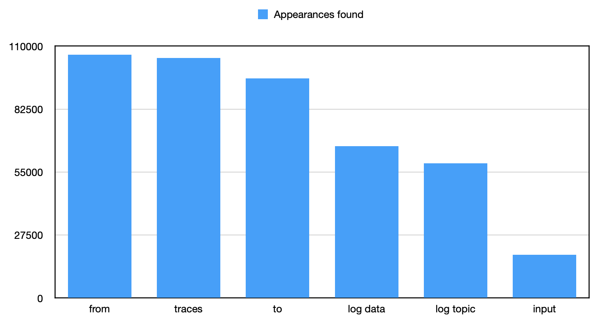

# TrueBlocks Comparison with Alchemy, Covalent and Etherscan

- [TrueBlocks Comparison with Alchemy, Covalent and Etherscan](#trueblocks-comparison-with-alchemy-covalent-and-etherscan)
  - [The Problem](#the-problem)
  - [Introduction](#introduction)
  - [What We Compared](#what-we-compared)
  - [The Results](#the-results)
    - [Row descriptions](#row-descriptions)
    - [Summary](#summary)
    - [Bug in Etherscan related to Uncles](#bug-in-etherscan-related-to-uncles)
  - [What is an Appearance?](#what-is-an-appearance)
  - [Why Does This Matter?](#why-does-this-matter)
  - [Replicating The Test](#replicating-the-test)

## The Problem

It's impossible to do perfect, automated, off-chain accounting using blockchains.

This is absurd given that blockchains reconcile hundreds of millions of accounts to 18-decimal place accuracy every so many seconds. Perfect. 18-decimal-place accurate.

## Introduction

TrueBlocks' [Unchained Index](https://trueblocks.io/papers/2023/specification-for-the-unchained-index-v2.0.0-release.pdf) is the best _index of appearances_ that we know of. ([See below for what an appearance is](#what-is-an-appearance).) The Unchained Index makes note of any time an address appears anywhere on the chain. No other indexer is as complete. In this article, we show the above claim to be true.

We compare the Unchained Index with three major Web 2.0 blockchain data providers: **Alchemy**, **Covalent** and **Etherscan**.

Spoiler alert: TrueBlocks far outperforms all of them.

## What We Compared

We queried 1,000 randomly-selected addresses against TrueBlocks, Alchemy, Covalent, and Etherscan for account histories. The results (which we admit are surprising) are presented below.

We were very careful to use each providers endpoints to ensure a fair test. We were also careful to handle errors properly. In our code, had there been an error response from a provider, the testing tool would exit (and we would have to re-run the test).

Becuase TrueBlocks is local-first and not shared with others, there is no rate limiting. We think this is one of the main reasons for the results. TrueBlocks is MUCH faster -- we can dig deeper.

## The Results

As noted, we test 1,000 randomly-selected addresses against four different providers. The list of addresses is available in `addresses.txt` file in this repo. The README explains how to run the test for yourself. The results are saved to SQLite database to allow subsequent queries.

Of the 1,000 addresses, we found that at least 102 had never transacted. These addresses were discarded. Additionally, we found that 207 addresses had transacted 5,000 or more times. We discarded these as well. We did this primarily because of Etherscan's free-teir limit on the number of they will return. To make things fair, we wanted to stay as far away from that limit as possible.

This left use with **691** addresses to test. The results are summarized below.

|                                              | TrueBlocks | Covalent | Etherscan | Alchemy |
| -------------------------------------------- | :--------- | :------- | :-------- | :------ |
| Initial addresses included                   | 1,000      | 1,000    | 1,000     | 1,000   |
| Eliminated due to 5,000 or more txs          | 207        | 207      | 207       | 207     |
| Eliminated due to zero txs                   | 102        | 121      | 106       | 344     |
| Addresses queried                            | 691        | 672      | 687       | 449     |
| Appearances found                            | 456,269    | 311,929  | 289,312   | 80,851  |
| Addresses with txs only found by...          | 506        | 0        | 14        | 0       |
| Unique appearances not found by others       | 120,744    | 0        | 364*      | 0       |
| Unique appearances where ETH balance changed | 1,194      | 0        | 0         | 0       |

\* &mdash; See [Bug in Etherscan](#bug-in-etherscan-related-to-uncles) for an explanation of this number.

### Row descriptions

- **Inital addresses included** is the initial number of addresses before filtering any addresses out
- **Eliminated due to > 5,000** is the number of addresses exceeding allowed appearance total (5,000 in this case, see the paragraph above)
- **Eliminated due to zero** is the number of addresses for which the given provider returned no appearances
- **Addresses queried** is the total number of addresses not exceeding allowed appearance total that a provider returned data for
- **Appearances found** is the total number of appearances returned by a provider
- **Addresses with txs only found by...** is the number of addresses for which _only_ the given provider returned appearances
- **Unique appearances not found by others** is the number of appearances reported _only_ by the given provider
- **Unique appearances where balance changed** shows how many Unique Appearances involved balance change (ETH only)

### Summary

Of the **691** addresses that were actually queried:

- **506** (**73%**) addresses had appearances found only by TrueBlocks. That's **120,744** more appearances!
- **1,194** appearances found by TrueBlocks changed address' ETH balance
- **NO** appearances were found by other providers that were not also found by TrueBlocks
- **Only** TrueBlocks found appearances for all **691** addresses
- for **14** addresses, Etherscan found 364 different appearances than TrueBlocks, but in all 14 cases, the difference was due to a bug in Etherscan. ([See below](#bug-in-etherscan-related-to-uncles).)

We recognize that these results are surprising and may seem like a mistake. But one should realize that TrueBlocks looks for more than just a small set of known behaviours (such as `Transfers`). TrueBlocks looks everywhere. In particulate, TrueBlocks looks in:

- the obvious places (`to`, `from`, `log generator`, etc.)
- every transaction's `input` data
- every log's `topics` and `data`
- every trace's `input` and `output` fields
- `mining` and `uncle` rewards
- `staking` withdrawals

Here's the breakout of where those **456,269** appearances were found:



### Bug in Etherscan related to Uncles

For **14** of the **687** addresses searched by Etherscan, appearances were returned that TrueBlocks did not find. In every case, however, the difference was due to a bug in Etherscan related to uncles. The bug is that Etherscan returns the block number when the uncle was "produced". TrueBlocks returns the block number in which the uncle reward was credited to the miners's account. We know this because we ran the following analysis on all **364** appearances of this issue.

First, we extracted just the block number from the appearances found by Etherscan. We then calculated 1 block prior to that block number (P) and seven blocks after that block number (A). We then ran:

```shell
chifra state --parts balance P-A <address> --changes
```

which uses another one of the `chifra` tools to extract the balances for the given address at the given blocks. For example, for address `0x3f98e477a361f777da14611a7e419a75fd238b6b`, Etherscan reports the following appearances:

```shell
485,uncle
940,uncle
1114,uncle
...
```

This command

```shell
chifra state --parts balance 484-492 0x48040276e9c17ddbe5c8d2976245dcd0235efa43
```

returns

| blockNumber | address                                    | balance             |
| ----------- | ------------------------------------------ | ------------------- |
| 484         | 0x48040276e9c17ddbe5c8d2976245dcd0235efa43 | 0                   |
| 485         | 0x48040276e9c17ddbe5c8d2976245dcd0235efa43 | 0                   |
| 486         | 0x48040276e9c17ddbe5c8d2976245dcd0235efa43 | 0                   |
| 487         | 0x48040276e9c17ddbe5c8d2976245dcd0235efa43 | 3750000000000000000 |
| 488         | 0x48040276e9c17ddbe5c8d2976245dcd0235efa43 | 3750000000000000000 |
| 489         | 0x48040276e9c17ddbe5c8d2976245dcd0235efa43 | 3750000000000000000 |
| 490         | 0x48040276e9c17ddbe5c8d2976245dcd0235efa43 | 3750000000000000000 |
| 491         | 0x48040276e9c17ddbe5c8d2976245dcd0235efa43 | 3750000000000000000 |

As you can see, Etherscan reports the uncle block at block 485. However, the uncle reward was not credited to the miner's account until block 487. TrueBlocks reports the uncle at block 487.

In all 364 cases, the block Etherscan reports as the uncle block is technically correct. However, the uncle reward was not credited to the miner's account until a few blocks later. In each case, that block was the block that TrueBlocks reported. Etherscan got it wrong. Unless you want to lean on a technicality. I would argue that a change in balance of an account is the correct place to note in an address's history. I'll leave it up to Etherscan to decide if they want to fix this bug.

Total number of place where Etherscan legitmately found more appearances than TrueBlocks: **ZERO**!

## What is an Appearance?

"Appearances" are seemingly simple. For any address, the address's list of appearances is a list of blocknumber.transactionId pairs noting whereever the address appears on the chain.

For example, the first three appearances for `trueblocks.eth` are:

| blockNumber | transactionIndex |
| ----------- | ---------------- |
| 8854723     | 61               |
| 8856290     | 62               |
| 8856316     | 91               |

Easy enough. Just look at `from`, `to`, `log topics` and a few other places. That's what most indexers do. But as we've demonstrated above, there's way more to the story. Please see a very detailed discussion in the [Specification of the Unchained Index](https://trueblocks.io/papers/2023/specification-for-the-unchained-index-v2.0.0-release.pdf).

## Why Does This Matter?

Blockchains are perfect, 18-decimal place accurate accounting systems. Every 12 seconds, they come to balance on many hundreds of millions of accounts. That's true on-chain.

The fact that even Etherscan, our industries leading data provider can't get it right, is imporant because blockchains should balance perfectly off-chain as well as on-chain. What the hell are we even building otherwise if we can't account for every single wei for every single account. That's what TrueBlocks does. That's what TrueBlocks is.

## Replicating The Test

Staying objective and working on permissionless public goods has always been important for us. As with our software, which requires no trust between the parties (us, our users, data consumers, you!) we want to make sure anyone can replicate this test.

In order to run the test on your own, you will need TrueBlocks Core (`chifra`) [installed](https://trueblocks.io/docs/install/install-core/). You will also need a local Ethereum archive node (Erigon or Reth recommended) or REALLY fast access to a remote node. The [DAppNode](https://dappnode.com) can be handy if you want to run the node yourself.

Next, clone [this repo](https://github.com/TrueBlocks/trueblocks-compare). Follow the instructions from the README to set up the test code.

Share your results with us, on [X/Twitter](https://twitter.com/trueblocks) or [GitHub](https://github.com/TrueBlocks/trueblocks-compare/issues/new). If you have questions, we invite you to join [our Discord server](https://discord.com/invite/kAFcZH2x7K).
